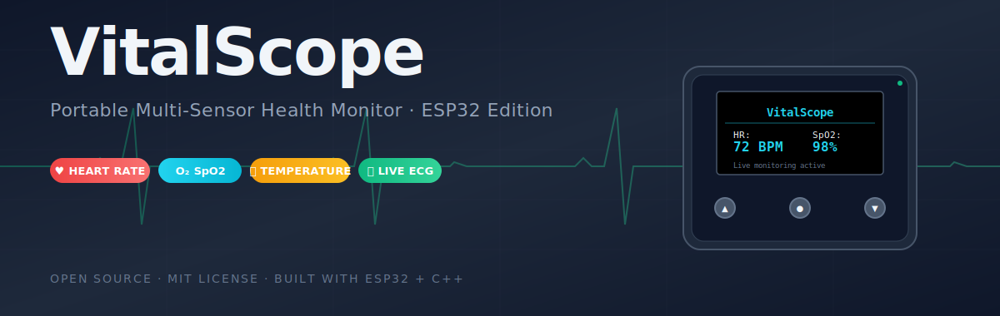
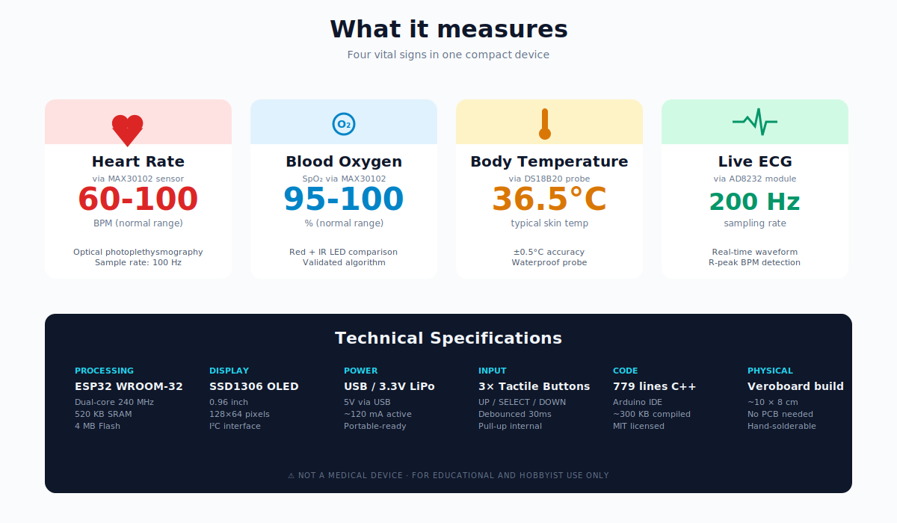
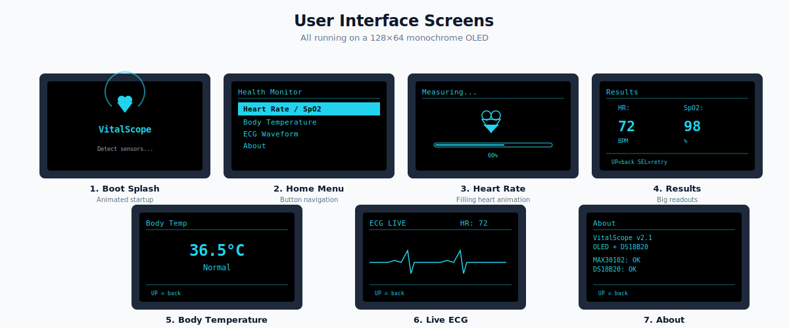
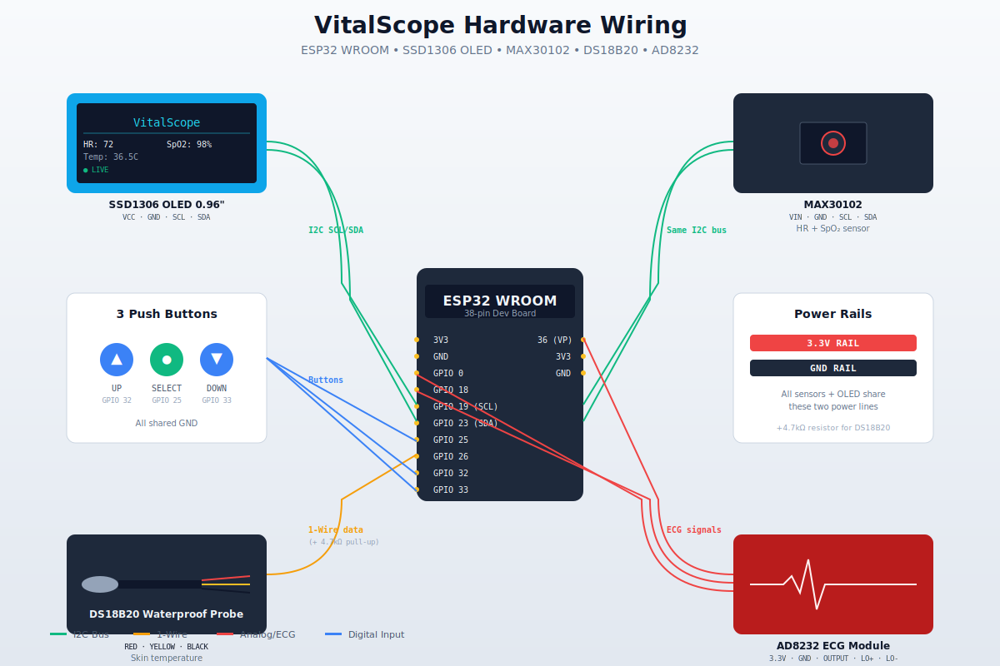
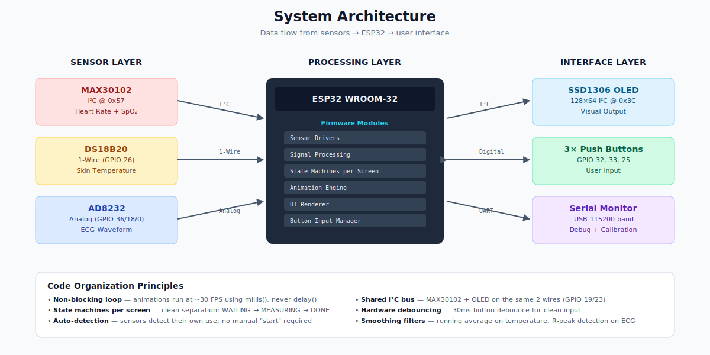

<div align="center">



# VitalScope

### A portable, multi-sensor health monitor built on ESP32

*Heart rate · Blood oxygen · Body temperature · Live ECG — in one compact device*

[](https://opensource.org/licenses/MIT)
[](https://www.espressif.com/)
[](https://www.arduino.cc/)
[]()
[]()

[Features](#-features) ·
[Hardware](#-hardware) ·
[Wiring](#-wiring) ·
[Build Guide](#-build-guide) ·
[Code Walkthrough](#-code-walkthrough) ·
[Demo](#-demo)

</div>

---

## 📖 About

**VitalScope** is a do-it-yourself, open-source health monitoring system that combines four key biosignal measurements — heart rate, blood oxygen saturation, body temperature, and real-time ECG — into a single portable, battery-friendly device. Built around an ESP32 microcontroller with a crisp monochrome OLED display, navigated via tactile buttons, and powered by carefully-engineered C++ firmware, VitalScope demonstrates how clinical-grade biosensors can be assembled on a hobbyist budget.

This project showcases a complete embedded engineering workflow: from sensor selection, signal-conditioning theory, microcontroller pin-budget planning, robust state-machine design, animated user interface programming, and full hardware integration testing — all packaged in a build that is reproducible by anyone with a soldering iron.

> **Why does this exist?** Most published embedded biosensor projects either focus on a single vital sign or rely on cloud APIs to do the heavy lifting. VitalScope brings four measurements together with all signal processing happening on-device, in real time, with under 1000 lines of code. It is a complete, standalone, self-contained system.

---

## ✨ Features



| Feature | Implementation |
|---|---|
| 💓 **Heart Rate** | Photoplethysmography via MAX30102, 100 Hz sampling, validated SparkFun algorithm |
| 🫁 **SpO₂** | Dual-LED (Red + IR) ratio comparison, calculated on-device |
| 🌡️ **Body Temperature** | DS18B20 waterproof probe with 5-sample running average, ±0.5°C accuracy |
| 📈 **Live ECG** | AD8232 amplifier + ESP32 ADC at 200 Hz, real-time R-peak BPM extraction |
| 🎬 **Animated UI** | Custom monochrome animations on 128×64 OLED — pulsing finger, filling heart, scrolling waveform |
| ⚡ **Auto-Detection** | Sensors detect their own usage state — no manual "start" required |
| 🔘 **Button Navigation** | Three-button menu system with 30ms hardware debouncing |
| 🔋 **Portable Ready** | Runs on USB or LiPo, ~120 mA active current |

---

## 🖼️ Screens

The user interface is built around a clean, scrollable menu system with animated feedback for every action:



| # | Screen | Trigger | What it shows |
|---|---|---|---|
| 1 | **Boot Splash** | Power on | Animated heart + spinning loader + init status |
| 2 | **Home Menu** | After boot | 4 menu items, scrollable, highlighted selection |
| 3 | **Heart Rate** | Select "Heart Rate / SpO2" | Pulsing finger waiting → filling heart measuring |
| 4 | **Results** | Measurement complete | Big BPM + SpO₂ numbers, retake option |
| 5 | **Body Temp** | Select "Body Temperature" | Animated thermometer → live temperature + status |
| 6 | **Live ECG** | Select "ECG Waveform" | Pulsing electrodes → real-time scrolling waveform |
| 7 | **About** | Select "About" | System info, sensor status, version |

---

## 🛠️ Hardware

### Bill of Materials

| Component | Quantity | Approximate Cost | Source |
|---|---|---|---|
| ESP32 WROOM-32 (38-pin dev board) | 1 | $7 | Any Arduino-compatible store |
| 0.96" SSD1306 OLED Display (I²C) | 1 | $4 | Generic blue/white module |
| MAX30102 Pulse Oximeter & HR Sensor | 1 | $6 | SparkFun or generic |
| DS18B20 Waterproof Temperature Probe | 1 | $4 | Generic 1m lead probe |
| AD8232 ECG Module (SparkFun-compatible) | 1 | $20 | With electrode cable |
| ECG Electrode Pads (snap-on, disposable) | 10 | $5 | Pharmacy or online |
| Tactile Push Buttons (6mm × 6mm) | 3 | $1 | Any electronics store |
| Resistor 4.7 kΩ (¼ W) | 1 | $0.05 | For DS18B20 pull-up |
| Veroboard / Stripboard | 1 | $2 | Standard 0.1" pitch |
| Jumper wires (assorted) | ~30 | $3 | Male and female |
| 19-pin female headers | 2 | $1 | For ESP32 socket |
| **Total Build Cost** | | **~$53** | |

### Quick Compare with Commercial Alternatives

| Product | Cost | Vitals Measured |
|---|---|---|
| Commercial fingertip pulse oximeter | $30 | HR + SpO₂ |
| Smart thermometer | $25 | Temperature only |
| Single-lead ECG patch | $90+ | ECG only |
| **VitalScope (this project)** | **$53** | **All four** |

---

## 🔌 Wiring



### Complete Pin Map

| ESP32 Pin | Component | Function |
|---|---|---|
| `3.3V` | All sensors + OLED | Power rail (red) |
| `GND` | All sensors + OLED + buttons | Ground rail (black) |
| `GPIO 19` | MAX30102, OLED | I²C clock (shared) |
| `GPIO 23` | MAX30102, OLED | I²C data (shared) |
| `GPIO 26` | DS18B20 | 1-Wire data (+4.7kΩ pull-up to 3.3V) |
| `GPIO 36 (VP)` | AD8232 | Analog ECG output |
| `GPIO 18` | AD8232 | Lead-off detect (LO+) |
| `GPIO 0` | AD8232 | Lead-off detect (LO-) |
| `GPIO 32` | Button | UP / back navigation |
| `GPIO 33` | Button | DOWN navigation |
| `GPIO 25` | Button | SELECT / confirm |

### Key Hardware Decisions

- **Shared I²C bus** for OLED and MAX30102 — only 2 GPIO pins for both (addresses 0x3C and 0x57 don't collide)
- **Internal pull-ups** on button pins — no external resistors needed
- **External 4.7 kΩ pull-up** on DS18B20 data line — required by 1-Wire protocol
- **Socketed ESP32** — pull it out of veroboard headers to reprogram, avoiding GPIO 0 boot conflicts with AD8232

---

## 🧠 System Architecture



The firmware follows a strict three-layer design:

1. **Sensor layer** — wrappers around each sensor library exposing a consistent API (`maxFingerPresent()`, `dsRead()`, `ecgRaw()`, etc.)
2. **Logic layer** — per-screen state machines, each with `WAITING → ACTIVE → DONE` transitions and auto-detection of sensor usage
3. **Presentation layer** — animation primitives (pulsing finger, filling heart, scrolling waveform) and a unified renderer that targets the SSD1306

This separation makes it easy to swap sensors, add new screens, or port the UI to a different display in the future.

---

## 🚀 Build Guide

### Step 1 — Install required libraries

Open Arduino IDE → **Tools → Manage Libraries**, then install:

- `Adafruit GFX Library` by Adafruit
- `Adafruit SSD1306` by Adafruit
- `SparkFun MAX3010x Pulse and Proximity Sensor Library`
- `OneWire` by Paul Stoffregen
- `DallasTemperature` by Miles Burton

### Step 2 — Set up the ESP32 board

If you don't have ESP32 support installed yet:

1. **File → Preferences**
2. Add to "Additional Board Manager URLs":
   ```
   https://espressif.github.io/arduino-esp32/package_esp32_index.json
   ```
3. **Tools → Board → Boards Manager**, search "esp32", install **esp32 by Espressif Systems**
4. **Tools → Board → ESP32 Arduino → ESP32 Dev Module**

### Step 3 — Wire everything on a veroboard

Use the wiring diagram above. Recommended assembly order:

1. Solder the ESP32 socket (female headers)
2. Wire the power rails (3.3V red, GND black)
3. Add the OLED (4 wires)
4. Add MAX30102 (4 wires, shares I²C bus)
5. Add DS18B20 (3 wires + the 4.7 kΩ resistor)
6. Add AD8232 (5 wires)
7. Add 3 push buttons (3 signal wires + shared GND)

Verify with a multimeter that 3.3V and GND rails are not shorted before powering on.

### Step 4 — Flash the firmware

1. Open `src/VitalScope_OLED_v2/VitalScope_OLED_v2.ino` in Arduino IDE
2. **Unplug the ESP32 from the veroboard** (avoids GPIO 0 boot conflicts with AD8232)
3. Connect via USB
4. Click **Upload**
5. Plug the ESP32 back into the veroboard
6. Power on — boot splash should appear within 3 seconds

### Step 5 — Calibrate the sensors (optional but recommended)

Before deploying, run `src/SensorCalibration/SensorCalibration.ino` to verify every sensor works individually via the Serial Monitor. The calibration sketch offers a menu-driven test for each sensor and even helps tune the finger-detection threshold.

---

## 💻 Code Walkthrough

The main firmware (`src/VitalScope_OLED_v2/VitalScope_OLED_v2.ino`) is structured for clarity:

```
Initialization
├── I²C bus setup (shared between MAX30102 and OLED)
├── Sensor init (each with success/failure status)
├── Button pins with internal pull-ups
└── Boot splash animation

Main Loop
└── switch (currentScreen)
    ├── runHome()     — menu navigation
    ├── runHR()       — state machine: WAIT → MEASURE → DONE
    ├── runTemp()     — state machine: WAIT → SHOW
    ├── runECG()      — state machine: WAIT → LIVE (scrolling buffer)
    └── runAbout()    — system info screen
```

### Notable techniques used

**Non-blocking animation timing**
```cpp
float phase01(uint32_t periodMs) {
    return (float)(millis() % periodMs) / (float)periodMs;
}
```
Returns a 0-to-1 phase that cycles every `periodMs` milliseconds. Animations use `sinf(phase * 2.0f * PI)` to create smooth oscillations without ever blocking the main loop.

**Auto-detection of sensor usage**
```cpp
bool maxFingerPresent() {
    if (!hasMax) return false;
    max30102.check();
    if (max30102.available()) {
        uint32_t ir = max30102.getIR();
        max30102.nextSample();
        return ir > 50000;
    }
    return false;
}
```
The MAX30102 detects a finger by the infrared reflection threshold. No manual "start" — just touch the sensor and measurement begins.

**Smoothed temperature with running average**
```cpp
tempSmoothBuf[tempSmoothIdx % 5] = c;
float sum = 0;
int n = min(tempSmoothIdx, 5);
for (int i = 0; i < n; i++) sum += tempSmoothBuf[i];
float smooth = sum / n;
```
Five-sample rolling average dampens out sensor noise without slowing response time.

**Real-time ECG R-peak detection**
```cpp
if (prevRaw < 2500 && raw > 2500 && millis() - ecgLastBeat > 300) {
    uint32_t dt = millis() - ecgLastBeat;
    if (ecgLastBeat > 0) ecgBpm = 60000 / dt;
    ecgLastBeat = millis();
}
```
Threshold crossing detection with a 300 ms refractory period extracts BPM directly from the ECG waveform in real time.

---

## 📊 Performance Characteristics

| Metric | Value |
|---|---|
| Boot time | ~3 seconds |
| HR/SpO₂ measurement time | ~10 seconds (100 samples × 100 Hz) |
| ECG sample rate | 200 Hz |
| ECG R-peak detection latency | < 50 ms |
| UI frame rate | ~30 FPS during animations |
| Button debounce | 30 ms |
| I²C bus speed | 400 kHz |
| Memory footprint | ~300 KB (well under ESP32's 4 MB flash) |

---

## 📷 Real Build Photos

> _Placeholder for your own photos. Add your build images here once you've finished assembly._
>
> Recommended shots:
> 1. **Top-down veroboard** — clean shot of the finished build
> 2. **OLED in action** — boot splash or live measurement on screen
> 3. **In-use** — finger on MAX30102 with readings visible
> 4. **ECG demonstration** — electrodes attached, waveform on screen
>
> Drop them in `docs/images/photos/` and reference here:
> ```markdown
> 
> ```

---

## ⚠️ Safety & Disclaimers

> **VitalScope is not a medical device.** It is an educational and hobbyist project designed to demonstrate biosensor integration and embedded systems engineering. Do **not** use it for medical diagnosis, treatment monitoring, or any clinical decision-making. Always consult a licensed healthcare professional for medical concerns.

**Electrical safety:** Always power the AD8232 via the ESP32's 3.3 V rail (via USB or LiPo). Never connect electrodes to the body while the system is plugged into a non-isolated AC adapter.

**Hygiene:** ECG electrode pads are single-use. The MAX30102 finger contact area should be wiped between users.

---

## 🤝 Contributing

Contributions are welcome! Areas where help would be especially appreciated:

- 📱 BLE companion app for live data streaming to phones
- 💾 SD card data logging for long-term tracking
- 🧪 Improved signal filtering (50/60 Hz notch filter for ECG)
- 🎨 Custom PCB design to replace the veroboard build
- 🌡️ Additional sensor support (BME280, MLX90614 forehead temp)
- 🌍 Translations of the README into other languages

Open an issue or pull request — and have fun.

---

## 📚 References & Inspiration

- [MAX30102 Datasheet](https://www.analog.com/media/en/technical-documentation/data-sheets/max30102.pdf) — Analog Devices
- [AD8232 Datasheet](https://www.analog.com/media/en/technical-documentation/data-sheets/ad8232.pdf) — Analog Devices
- [DS18B20 Datasheet](https://www.analog.com/media/en/technical-documentation/data-sheets/ds18b20.pdf) — Maxim Integrated
- [SparkFun MAX30102 Hookup Guide](https://learn.sparkfun.com/tutorials/max30105-particle-and-pulse-ox-sensor-hookup-guide)
- [ESP32 Pin Reference](https://randomnerdtutorials.com/esp32-pinout-reference-gpios/)

---

## 📜 License

This project is released under the [MIT License](LICENSE) — see the LICENSE file for details.

You are free to use, modify, distribute, and even sell derivatives of this work — just keep the copyright notice intact.

---

<div align="center">

**Built with ☕ and a soldering iron.**

*If this project helped you, give it a ⭐ — it really helps!*

</div>
